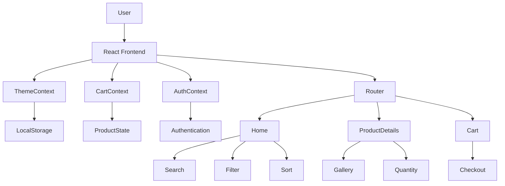
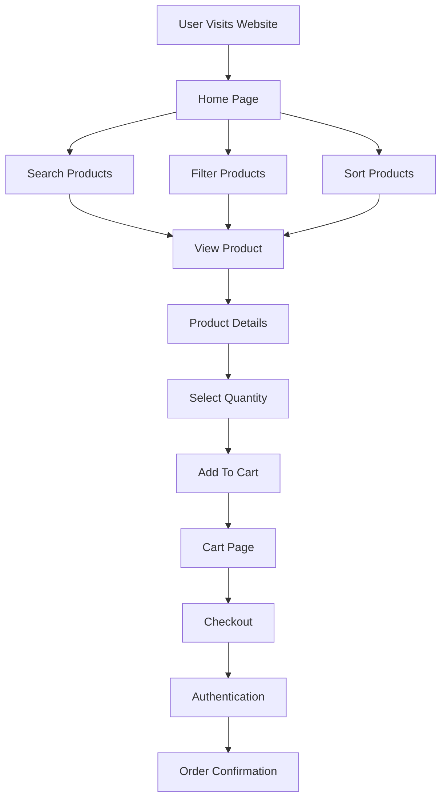

<div align="center">


<br/>

[](https://e-commerce-web-luke.netlify.app/)


</div>

---

# 🛍️ Overview

**LUXE** is a premium modern E-Commerce platform crafted with **React**, **Tailwind CSS**, and **Vite**.

Built with a luxury-inspired design system, immersive animations, glassmorphism components, dual-theme support, intelligent product discovery, and a seamless shopping experience.


### 🔗 Live Demo

https://e-commerce-web-luke.netlify.app/

---

# ✨ Key Highlights

- 🎨 Premium Luxury UI
- 🌗 Dynamic Light & Dark Themes
- ⚡ Vite Powered Performance
- 🔍 Smart Product Search
- 🏷️ Advanced Product Filtering
- 📱 Fully Responsive Design
- 🛒 Interactive Cart System
- 🔐 Authentication Modals
- 💾 Persistent Storage
- 🔔 Toast Notification System
- 🎭 Glassmorphism Components
- 🚀 Production Ready Architecture

---

# 🎨 Theme System

### ☀️ Light Mode

- Elegant luxury-inspired interface
- Soft neutral backgrounds
- Premium typography
- High readability


### 🌙 Dark Mode

- Deep contrast visuals
- Enhanced focus on products
- Smooth animated transitions
- Persistent theme preferences


### Theme Features

- Animated Sun / Moon Toggle
- 0.4s Smooth Theme Transition
- localStorage Persistence
- Dynamic Color Variables

---

# 📄 Pages Overview

| Page | Description |
|--------|------------|
| 🏠 Home | Product discovery, search, filters & sorting |
| 📦 Product Details | Gallery, stock status, quantity controls |
| 🛒 Cart | Shopping cart & checkout summary |
| 🔐 Auth Modal | Login & Signup experience |

---

# ✨ Features & Micro Interactions

## 🎨 Visual Experience

- Glassmorphism Navbar
- Floating Background Animations
- Animated Theme Toggle
- Smooth Hover Effects
- Dynamic Product Badges
- Animated Page Transitions

## 🔍 Product Discovery

- Real-Time Search
- Category Filters
- Smart Sorting
- Featured Collections
- Empty Search States

## 📦 Product Experience

- Product Gallery
- Dynamic Pricing
- Stock Tracking
- Quantity Controls
- Related Products

## 🛒 Shopping Experience

- Cart Management
- Shipping Calculator
- Order Summary
- Checkout Workflow
- Authentication Integration

---

# 🛠️ Technology Stack

<div align="center">


</div>

| Category | Technology |
|-----------|-----------|
| Framework | React 18 |
| Build Tool | Vite |
| Styling | Tailwind CSS |
| Routing | React Router DOM |
| State Management | Context API |
| Storage | localStorage |
| Deployment | Netlify |

---

# 🏗️ System Architecture



---

# 🔄 Application Workflow



---

# 📁 Project Structure

```bash
src/
├── components/
│   ├── AuthModal.jsx
│   ├── Navbar.jsx
│   ├── ProductCard.jsx
│   ├── ThemeToggle.jsx
│   └── Toast.jsx
│
├── context/
│   ├── AuthContext.jsx
│   ├── CartContext.jsx
│   └── ThemeContext.jsx
│
├── data/
│   └── products.js
│
├── pages/
│   ├── Home.jsx
│   ├── ProductDetail.jsx
│   └── Cart.jsx
│
├── App.jsx
├── main.jsx
└── index.css
```

---

# 🚀 Getting Started

### Clone Repository

```bash
git clone https://github.com/ayushtripathi8846-eng/CODEVEDX_Task3_-E-Commerce_Product-Page.git
```

### Install Dependencies

```bash
npm install
```

### Start Development Server

```bash
npm run dev
```

### Production Build

```bash
npm run build
```

---

# 📊 Project Statistics

### Core Features

✅ Light / Dark Theme

✅ Authentication System

✅ Product Search

✅ Category Filtering

✅ Cart Management

✅ Product Recommendations

✅ Responsive Layout

✅ Persistent Storage

---

# 🔮 Future Enhancements

### Phase 2

- 🔐 JWT Authentication
- ❤️ Wishlist System
- ⭐ Product Reviews
- 📦 Order History
- 💳 Razorpay Integration

### Phase 3

- 🤖 AI Product Recommendations
- 📊 Admin Dashboard
- 📈 Analytics Panel
- 🌎 Multi-Language Support
- 📱 Progressive Web App

---

# 🌐 Deployment

| Service | Status |
|----------|---------|
| Netlify | ✅ Live |
| Vercel | ⚡ Compatible |
| GitHub Pages | ⚡ Compatible |

---

# 👨‍💻 Developer

<div align="center">

## Ayush Tripathi

### Full Stack Developer

<a href="https://github.com/ayushtripathi-45">

</a>

<a href="https://linkedin.com">

</a>

<a href="mailto:yourmail@gmail.com">

</a>

<br/><br/>


</div>

---

<div align="center">

### ⭐ If you like this project, give it a Star


</div>

